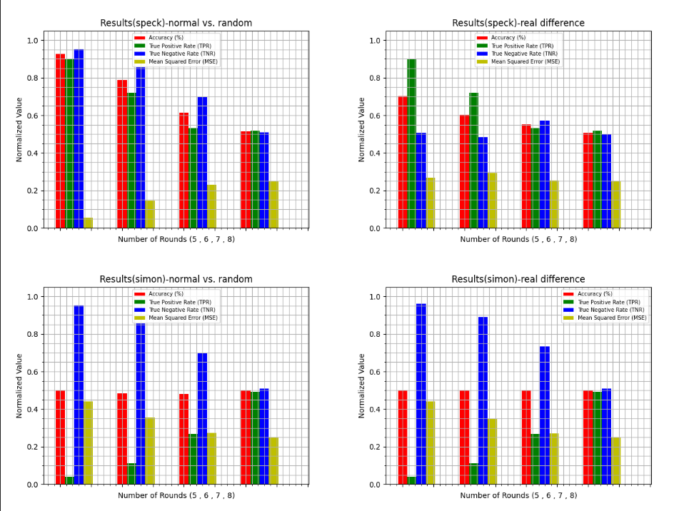
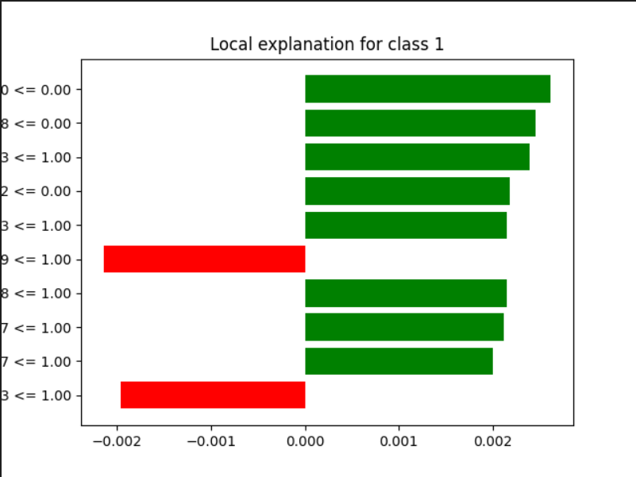

# CryptoXAI

## Prerequiste
Before you get started, make sure you have satisfied the following software
requirements:
### Python (v 3.8 or greater) and pip:
● The easiest way to install Python is to use the official Python installer. You
can download the installer from the Python website:
https://www.python.org/downloads/

● Once you have downloaded the installer, run it and follow the on-screen
instructions.

● This also installs pip (the package manager of Python). For verification of
it’s proper installation, run the following command in a terminal

**pip --version**

### TensorFlow (the latest GPU or CPU compatible version):
To install TensorFlow, you can use the pip package manager. Open a terminal
window and run the following command:

**pip install tensorflow**

Do note that if you want to install the GPU version of TensorFlow, you still need to
use the same command as above. However, due to the specific requirements of
the GPU version of Tensorflow, follow these steps to install the proper flavour of
Tensorflow

### NumPy:
To install NumPy, you can use the pip package manager. Open a terminal
window and run the following command:

**pip install numpy**

### Matplotlib:
To install Matplotlib, you can use the pip package manager. Open a terminal
window and run the following command:

**pip install matplotlib**

### LIME (Explainable AI model):
To install LIME, you can use the pip package manager. Open a terminal window
and run the following command:

**pip install lime**

### ImageIO
To install this lightweight image utility library, you can use the pip package 
manager. Open a terminal window and run the following command:

**pip install imageio**

## Hardware Specification: 
It must also be made sure that the following hardware specifications are met:

● Operating System: Windows 8 and above

● Storage: 12GB and above

● CPU: Intel i3 processor (4 cores recommended)

● RAM: 4GB and above

● GPU: Nvidia Geforce GTX 1650 (4 GB VRAM recommended)

## Description on files:

### Comparative_Analysis.py
This file contains the comparative analysis done between SPECK and SIMON.We have tested the encryption algorithm with a pre-trained ResNet model. Just run the code and a png file named results.png will pop showing the comparative analysis between SPECK and SIMON.

(Note: The SIMON code may take approximately 5-10 minutes to start computing due to the complexity of its algorithm)

*Figure 1: Shows the comparative analysis between SPECK and SIMON in results.png*

### ExplainableAI.py
This file contains the generation of graph for Lime explainability on the prediction made by ResNet. After running the code, a file named lime_explanation.png will be produced which contains the output of Explainable AI.

*Figure 2: Shows the explainability on the prediction of ResNet in lime_explanation.png*

**Understanding the Explainable AI output**

**Class 1:** The class that shows that an relationship still exist between the ciphertext.

**Y-axis:** Shows the bit position and its binary value.

**X-axis:** Shows the contribution value.

**Green bar:** Positive contribution towards the prediction result.

**Red bar:** Negative contribution towards the prediction result.

## Citation:

The **Speck.py** and **pre-trained distinguisher** files were retrieved from:

_Agohr. (n.d.). Agohr/deep_speck: Supplementary code and data to 
“improving attacks on round-reduced speck32/64 using Deep Learning.”_ 
* GitHub Link: *https://github.com/agohr/deep_speck*

The **Simon.py** file was retrieved from:

_inmcm/Simon_Speck_Ciphers: Implementations of the Speck & Simon 
Block Ciphers._
* Github Link: *https://github.com/inmcm/Simon_Speck_Ciphers*
